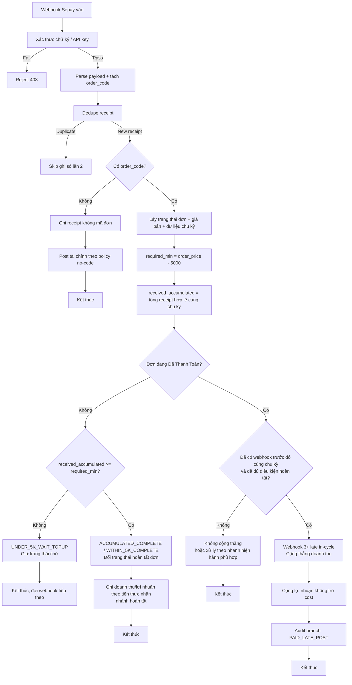
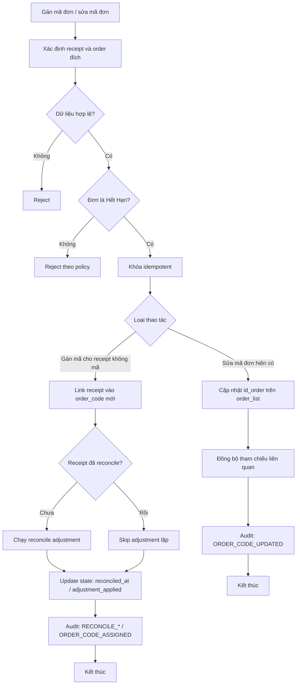

# Luồng Webhook Sepay - Đối Soát Và Ghi Sổ Tài Chính

## Mục tiêu

Tài liệu này mô tả **duy nhất luồng webhook Sepay** cho đơn hàng:

- Nhận webhook, dedupe và ghi receipt.
- Quy tắc đối soát số tiền với ngưỡng lệch `5.000 VND`.
- Quy tắc cộng dồn nhiều webhook trong cùng chu kỳ.
- Quy tắc ghi doanh thu/lợi nhuận và đổi trạng thái đơn.
- Guard tránh xung đột với nhánh cũ cộng thẳng doanh thu/lợi nhuận.

## Bảng dữ liệu liên quan

- `orders.payment_receipt`
- `orders.payment_receipt_financial_state`
- `orders.payment_receipt_financial_audit_log`
- `orders.order_list`
- `finance.dashboard_monthly_summary`

## 1) Luồng tổng quan

```text
Webhook vào
  -> Xác thực chữ ký/API key
  -> Parse payload + tách mã đơn
  -> Dedupe receipt
  -> Đối soát amount theo rule 5.000
  -> Quyết định:
       (A) Đủ điều kiện hoàn tất ngay
       (B) Chờ top-up webhook tiếp theo
  -> Ghi sổ tài chính theo nhánh
  -> Cập nhật trạng thái đơn (nếu đủ điều kiện)
  -> Ghi audit log
```

## 2) Rule amount theo ngưỡng 5.000

Định nghĩa:

- `order_price`: giá bán của đơn.
- `received_current`: số tiền của webhook hiện tại.
- `required_min = order_price - 5.000`.

Quy tắc:

- Nếu `received_current >= required_min`:
  - Đơn đủ điều kiện hoàn tất.
  - Ghi doanh thu/lợi nhuận theo **`received_current`**.
- Nếu `received_current > order_price`:
  - Vẫn hoàn tất đơn.
  - Ghi doanh thu/lợi nhuận theo **`received_current`**.
- Nếu `received_current < required_min`:
  - Chưa hoàn tất đơn.
  - Chuyển trạng thái flow: `AWAITING_TOPUP`.

## 3) Rule cộng dồn nhiều webhook cùng đơn

Áp dụng khi webhook hiện tại thiếu quá ngưỡng:

- Cộng dồn theo `id_order` trong cùng chu kỳ, chỉ lấy receipt hợp lệ (không duplicate).
- `received_accumulated = tổng receipt hợp lệ trong chu kỳ`.
- Nếu `received_accumulated >= required_min`:
  - Chuyển flow `ELIGIBLE_BY_ACCUMULATION`.
  - Hoàn tất đơn đúng 1 lần.
  - Ghi tài chính theo tổng thực nhận tích lũy.
- Nếu chưa đạt:
  - Giữ `AWAITING_TOPUP`, tiếp tục chờ webhook sau.

## 4) Quy tắc ghi tài chính

- Nhánh hoàn tất ngay theo ngưỡng 5.000:
  - Ghi theo tiền webhook thực nhận của lần hiện tại.
- Nhánh hoàn tất do cộng dồn:
  - Ghi theo tổng tiền webhook tích lũy trong chu kỳ.
- Nhánh chờ top-up:
  - Chưa đổi trạng thái hoàn tất đơn.
  - Chưa chạy nhánh tài chính hoàn tất đơn.

## 5) Guard chống xung đột với flow cũ

Trước khi chạy nhánh cũ cho trạng thái `Đã Thanh Toán` / `Đang Xử Lý`:

- Nếu receipt thuộc flow mới (`AWAITING_TOPUP` hoặc `ELIGIBLE_BY_ACCUMULATION`):
  - Không đi vào nhánh late-payment cũ.
  - Chỉ đi theo logic amount 5.000 + cộng dồn.
- Nếu không thuộc flow mới:
  - Giữ nguyên nhánh cũ theo rule hiện hành.

## 6) Audit log bắt buộc

Mỗi quyết định webhook cần ghi branch rõ ràng, đề xuất tối thiểu:

- `WITHIN_5K_COMPLETE`
- `OVERPAID_COMPLETE`
- `UNDER_5K_WAIT_TOPUP`
- `ACCUMULATED_COMPLETE`
- `SKIP_DUPLICATE_OR_ALREADY_POSTED`

Payload audit nên có:

- `order_code`
- `received_current`
- `received_accumulated`
- `order_price_at_webhook`
- `required_min`
- `shortfall_amount`
- `webhook_amount_flow`

## 7) Quy tắc hiển thị UI "Chênh lệch webhook"

- Dùng biên lai mới nhất của đơn:
  - `latest_delta = latest_webhook_amount - order_price`
- Nếu đơn đang chờ top-up:
  - Nên hiển thị thêm `accumulated_delta` để vận hành biết tiến độ đủ ngưỡng.

## 8) Phạm vi tài liệu này

- Chỉ mô tả webhook Sepay và quyết định tài chính liên quan webhook.
- Có kèm sơ đồ tổng quát cho thao tác gán/sửa mã đơn ở đơn hết hạn để vận hành.
- Không mô tả chi tiết luồng manual `Thanh Toán` / `Gia Hạn`.

## 9) Sơ đồ luồng webhook hiện tại



## 10) Sơ đồ gán mã đơn / sửa mã đơn cho đơn hết hạn


