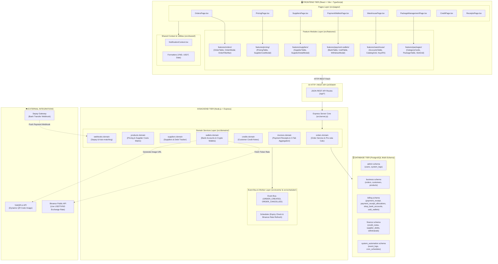
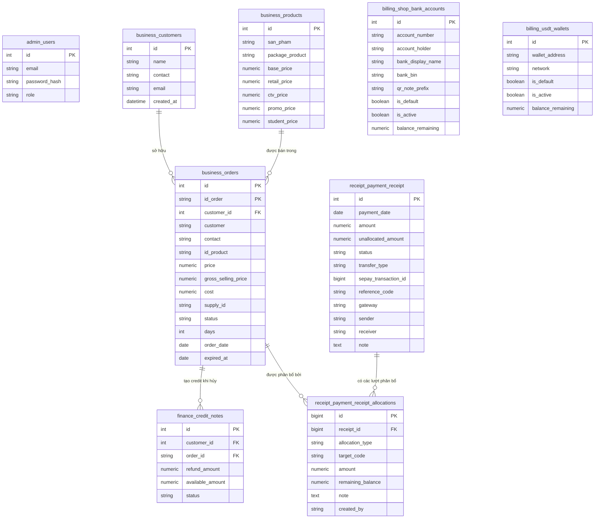

# SƠ ĐỒ KIẾN TRÚC HỆ THỐNG ADMIN STORE V2

Tài liệu này cung cấp sơ đồ kiến trúc tổng thể (System Architecture Diagram) của hệ thống **Admin Store V2**, mô tả luồng giao tiếp giữa Frontend Tier, Backend Tier, Database Schemas và các External Services.

---

## 📐 1. SƠ ĐỒ KIẾN TRÚC TỔNG QUAN (SYSTEM ARCHITECTURE)

---

## 🔄 2. SƠ ĐỒ LUỒNG SỰ KIỆN ĐƠN HÀNG (ORDER LIFECYCLE & EVENT BUS FLOW)

Sơ đồ thể hiện chi tiết luồng xử lý sự kiện khi tạo đơn mới và khi hủy đơn hàng:

```mermaid
sequenceDiagram
    autonumber
    actor User as Người Quản Lý (Admin)
    participant UI as OrderCreateEditModal (React)
    participant API as Express API (/api/orders)
    participant DB as PostgreSQL (business.orders)
    participant Cust as Customer Service (business.customers)
    participant Event as Event Bus
    participant Wh as Warehouse (Slot Manager)
    participant QR as VietQR Generator

    rect rgb(15, 23, 42)
    note over User, QR: 1. LUỒNG TẠO ĐƠN HÀNG MỚI (CREATE ORDER)
    User->>UI: Nhập thông tin & chọn Mã Tiền Tố (MAVC/MAVL/MAVK/MAVN)
    UI->>UI: Parse tên gói ➔ Tự động tính days & expired_at
    User->>UI: Bấm nút "Xác Nhận Tạo Đơn"
    UI->>API: POST /api/orders (Payload + generatedCode)
    API->>DB: INSERT INTO business.orders
    API->>Cust: UPSERT INTO business.customers (Tên, Contact)
    API->>Event: Emit Event 'ORDER_CREATED'
    Event->>Wh: Đánh dấu giữ chỗ Slot Kho (RESERVED / IN_USE)
    API-->>UI: Return Created Order Object
    UI->>QR: Format URL VietQR.io (Mã BIN + STK + Mã Đơn + Giá)
    UI-->>User: Tự động bật Modal Chi Tiết + VietQR Thu Tiền
    end

    rect rgb(30, 41, 59)
    note over User, QR: 2. LUỒNG HỦY ĐƠN HÀNG (CANCEL ORDER)
    User->>UI: Bấm nút "Hủy / Xóa Đơn Hàng"
    UI->>API: DELETE /api/orders/:id
    API->>DB: UPDATE status = 'CANCELLED'
    API->>API: Tính Giá Trị Còn Lại Pro-rata: price * (remaining_days / total_days)
    API->>Wh: Revert Slot Kho về 'AVAILABLE'
    API->>DB: INSERT INTO finance.credit_notes (Nạp Ví Credit Khách)
    API->>Event: Emit Event 'ORDER_CANCELLED'
    API-->>UI: Return Success + Pro-rata Refund Amount
    UI-->>User: Cập nhật UI, giảm doanh thu & chuyển đơn sang Tab 'canceled'
    end

    rect rgb(20, 83, 45)
    note over User, QR: 3. LUỒNG WEBHOOK & TỰ ĐỘNG KHỚP BIÊN LAI (WEBHOOK & AUTOMATED RECEIPT MATCHING)
    participant Bank as Ngân Hàng / SePay Webhook
    Bank->>API: POST /api/webhooks/sepay (Money In/Out Event)
    API->>Event: Emit 'WEBHOOK_MONEY_IN' / 'WEBHOOK_MONEY_OUT'
    Event->>API: Subscriber: processPaymentWebhook()
    API->>DB: Check Idempotency (sepay_transaction_id)
    API->>DB: INSERT INTO receipt.payment_receipt (status = 'UNALLOCATED')
    alt Tìm thấy đơn hàng khớp số tiền / mã đơn
        API->>DB: UPDATE receipt.payment_receipt (status = 'FULLY_ALLOCATED', unallocated_amount = 0)
        API->>DB: INSERT INTO receipt.payment_receipt_allocations (allocation_type = 'ORDER', target_code = id_order)
        API->>DB: UPDATE business.orders (status = 'Đã Thanh Toán' / gia hạn expired_at)
        API->>Event: Emit Event 'ORDER_PAID' / 'ORDER_RENEWED'
    else Không tìm thấy đơn trùng khớp
        API-->>API: Giữ trạng thái UNALLOCATED (Biên lai nằm ở Tab Chưa được liệt kê)
    end
    end
```

---

## 🗂 3. SƠ ĐỒ MỐI QUAN HỆ BẢNG DỮ LIỆU (ERD - DATABASE SCHEMAS)

---

## 📌 4. MÔ TẢ ĐẶC TÍNH NỔI BẬT CỦA KIẾN TRÚC V2

1. **Tách Biệt Trách Nhiệm (Separation of Concerns):**
   - Các file trang (`OrdersPage.tsx`, `PricingPage.tsx`, v.v.) chỉ giữ vai trò **Orchestrator** quản lý State tổng và nạp API.
   - Toàn bộ giao diện chi tiết, bảng dữ liệu, bộ lọc và modals được chuyển vào từng component nhỏ thuộc thư mục `src/features/<feature>/components/`.
2. **Quản Lý Sự Kiện Bất Đồng Bộ (Event Bus Pattern):**
   - Backend sử dụng Event Bus để phân tách luồng xử lý: Tạo đơn hàng không trực tiếp khóa luồng xử lý kho mà thông qua sự kiện `ORDER_CREATED` và `ORDER_CANCELLED`.
3. **Đa Schema Database (PostgreSQL Multi-Schema):**
   - Đảm bảo tính bảo mật và mở rộng theo chuẩn Doanh nghiệp: Phân chia rõ ràng giữa dữ liệu `admin`, nghiệp vụ kinh doanh `business`, hóa đơn cổng thanh toán `billing`, và tài chính ví `finance`.
